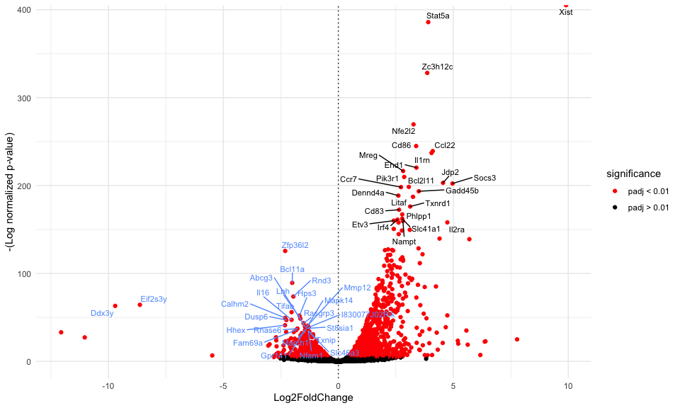
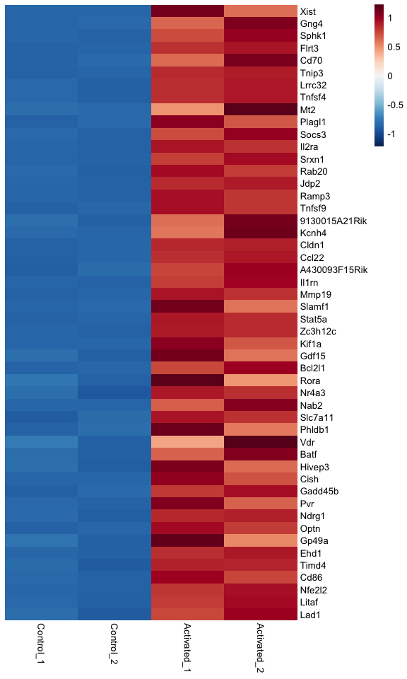
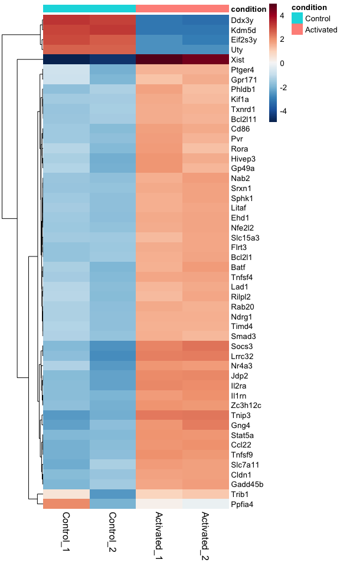
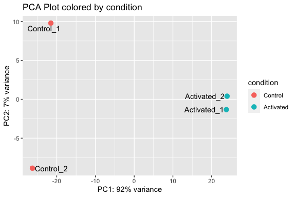

RNA-seq analysis of activated dendritic cells
================
Erick Lu

March 21, 2020

-   [The objective](#the-objective)
-   [The data](#the-data)
-   [Aligning and counting reads](#aligning-and-counting-reads)
-   [Differential gene expression analysis](#differential-gene-expression-analysis)
-   [Visualizations](#visualizations)
    -   [Volcano plot](#volcano-plot)
    -   [Heatmap of differentially expressed genes](#heatmap-of-differentially-expressed-genes)
    -   [Heatmap of highly variable genes](#heatmap-of-highly-variable-genes)
    -   [PCA plot](#pca-plot)
-   [Conclusion](#conclusion)

The objective
-------------

When performing research in biology, examining changes in gene expression helps one understand why or how certain processes occur. RNA-seq is often used to determine differences in global gene expression between two conditions.

In this project, our objective is to use RNA-seq to identify differentially expressed genes between activated and unactivated CD4+ dendritic cells. Identifying the markers and pathways that dendritic cells upregulate after activation will improve our understanding of how these cells support T-cell differentiation.

The results of this analysis were previously published in [Li et al. Nature 2016](https://www.ncbi.nlm.nih.gov/pmc/articles/PMC4883664/). Here, I will walk through an updated version of the analysis using newer tools. I will align the raw sequencing reads (FASTQ files) to a reference genome using `STAR`, count the number of reads per gene using `htseq-count`, and identify upregulated genes in activated CD4+ dendritic cells using the `DESeq2` package in R.

For a more in-depth guide about how to perform bulk RNA-seq analysis, you can check out my bulk RNA-seq [guide](https://github.com/erilu/bulk-rnaseq-analysis).

The data
--------

RNA-seq was performed on purified populations of CD4+ dendritic cells from mice treated with either an immune stimulus (SRBCs) or vehicle control (PBS). The raw sequencing data and experimental details are publicly available in the Gene Expression Omnibus (GEO) under accession [GSE71165](https://www.ncbi.nlm.nih.gov/geo/query/acc.cgi?acc=GSE71165). The FASTQ files can be downloaded using the NCBI SRA tools, following the instructions in this [guide](https://erilu.github.io/python-fastq-downloader/).

We will be working with four samples:

-   two biological replicates of unactivated (control) dendritic cells, named HET\_CD4\_1 and HET\_CD4\_2.
-   two biological replicates of activated dendritic cells, named IMM\_CD4\_1 and IMM\_CD4\_2.

For this experiment, paired-end sequencing was performed. There should be two files associated with each sample, corresponding to each paired-end read. If you downloaded the raw data from GEO, the files will be named after their SRA runs (e.g. SRR2121685 for HET\_CD4\_1). The files I will be working with are the original files that came from the sequencing facility, so their names will be different:

``` bash
ls *.fastq.gz
```

    ## Het_CD4_1_AAGGGA_L001_R1_001.fastq.gz  IMM_CD4_1_TTCAGC_L001_R1_001.fastq.gz
    ## Het_CD4_1_AAGGGA_L001_R2_001.fastq.gz  IMM_CD4_1_TTCAGC_L001_R2_001.fastq.gz
    ## Het_CD4_2_AAGACG_L002_R1_001.fastq.gz  IMM_CD4_2_TTCGCT_L002_R1_001.fastq.gz
    ## Het_CD4_2_AAGACG_L002_R2_001.fastq.gz  IMM_CD4_2_TTCGCT_L002_R2_001.fastq.gz

Aligning and counting reads
---------------------------

We will align our FASTQ files to the mouse reference genome using the RNA-seq alignment tool [STAR](https://github.com/alexdobin/STAR). The script below will run the `STAR` command to map both paired-end sequencing files for each biological replicate. It then uses `Samtools` and `htseq-count` to count how many reads were mapped to each gene in the transcriptome.

``` bash
# define the directory that contains the your reference genome
genomedir=/bigdata/genomes/mm10/STAR

# get list of samples in current directory using regexes
mylist="$(ls *.fastq.gz | perl -pe 's[^([^_]+_[^_]+\d_\d)_[ACGT]{6}_L00\d_R\d_\d\d\d.fastq.gz][$1]' | uniq )"

# loop through each sample and align both paired-end reads to the reference genome
for prefix in $mylist; do
  pairedend1=`ls ${prefix}_*_R1_*.fastq.gz`
  pairedend2=`ls ${prefix}_*_R2_*.fastq.gz`
  echo ${prefix}
  STAR --runThreadN 8 --genomeDir $genomedir/ --genomeLoad LoadAndKeep --readFilesIn $pairedend1 $pairedend2 --readFilesCommand zcat --outFileNamePrefix $prefix --outStd SAM --outFilterMultimapNmax 1 > ${prefix}.sam
  echo 'aligned'
done

# use samtools and htseq-count to count the reads per gene for each sample, output file is htseq.out
ls *.sam | parallel 'samtools view -bS {} | samtools sort -n -m2000000000 - {.}_byName'
# if you have an annotation file, "genes.gtf" in the line below should point to it
find . -name '*_byName.bam' | parallel 'samtools view -h {} | htseq-count --stranded=no - genes.gtf > {.}_htseq.out'
```

This should produce `_htseq.out` files for each biological replicate, which contain the number of counts per gene. I've placed these files in this repository in the folder `htseq_count_files/`.

Differential gene expression analysis
-------------------------------------

We can now read the `_htseq.out` files into R and perform differential gene analysis using the package [DESeq2](https://bioconductor.org/packages/release/bioc/html/DESeq2.html). I will be using version 1.26.0, and will take you through how to make a DESeq object, export differential gene lists, and plot visualizations to observe differences between groups of samples.

``` r
library(DESeq2)
library(tidyverse)
```

Because we are working with `_htseq.out` files, we will use the function `DESeqDataSetFromHTSeqCount()` to create a DESeq2 object. This function requires a sample table which identifies the file names, sample names, and groups that we want to compare.

``` r
# find all the htseq files in the directory and list them, naming them by what they represent (WT or IMM)
htseq_files = list.files(path = "htseq_count_files/", pattern = "*_htseq.out")
names(htseq_files) = c ("Control_1", "Control_2", "Activated_1", "Activated_2")
condition = factor(gsub("_\\d+$", "", names(htseq_files)) )
sample_table = data.frame(sample_name = names(htseq_files), file_name = htseq_files, condition = relevel(condition, ref = "Control"))
sample_table
```

    ##             sample_name                  file_name condition
    ## Control_1     Control_1 Het_CD4_1_byName_htseq.out   Control
    ## Control_2     Control_2 Het_CD4_2_byName_htseq.out   Control
    ## Activated_1 Activated_1 IMM_CD4_1_byName_htseq.out Activated
    ## Activated_2 Activated_2 IMM_CD4_2_byName_htseq.out Activated

As you can see, we have categorized the four data files into two groups: Control or Activated, defined by the "condition" column. We can now input the sample table into the `DESeqDataSetFromHTSeqCount()` function:

``` r
dds <- DESeqDataSetFromHTSeqCount(sample_table, directory = "htseq_count_files", design = ~ condition)
```

Then, we run the function `DESeq()` to process the data and compute the differentially expressed genes between groups:

``` r
dds <- DESeq(dds)
```

    ## estimating size factors
    ## estimating dispersions
    ## gene-wise dispersion estimates
    ## mean-dispersion relationship
    ## final dispersion estimates
    ## fitting model and testing

The results of the analysis can be extracted using the `results()` function on the `dds` object. The `contrast` argument specifies the two groups being compared:

``` r
results(dds, contrast = c("condition", "Activated", "Control"))
```

    ## log2 fold change (MLE): condition Activated vs Control
    ## Wald test p-value: condition Activated vs Control
    ## DataFrame with 23337 rows and 6 columns

    ##                  baseMean log2FoldChange     lfcSE        stat       pvalue
    ## 0610005C13Rik   3.5593163    -1.95589769 1.7983812 -1.08758792 2.767771e-01
    ## 0610007C21Rik 151.3048006    -0.81228863 0.2982761 -2.72327763 6.463771e-03
    ## 0610007L01Rik 542.9491558     0.85897669 0.1840570  4.66690611 3.057690e-06
    ## 0610007N19Rik   0.8000586     0.90950649 3.9096850  0.23262910 8.160494e-01
    ## 0610007P08Rik 208.1359047    -0.52530196 0.2599303 -2.02093421 4.328658e-02
    ## 0610007P14Rik 220.4997078    -0.01269141 0.2501174 -0.05074183 9.595312e-01
    ##                       padj
    ## 0610005C13Rik           NA
    ## 0610007C21Rik 2.910309e-02
    ## 0610007L01Rik 3.404312e-05
    ## 0610007N19Rik           NA
    ## 0610007P08Rik 1.296802e-01
    ## 0610007P14Rik 9.780393e-01

Because we are interested in genes that are significantly different between the two groups, we should filter for genes that have adjusted p-values below a threshold. We will also order the significant genes based on `log2FoldChange`, which allows us to identify the genes which are most greatly upregulated by the activated dendritic cells. For this comparison, higher `log2FoldChange` values mean a greater enrichment in the activated group. The function `generate_DE_results()` below will perform these filtering and ordering steps, and write the processed results to csv files.

``` r
generate_DE_results <- function (dds, comparisons, padjcutoff = 0.001) {
  # extract DESeq results between the comparisons indicated
  res <- results(dds, contrast = c("condition", comparisons[1], comparisons[2]))[,-c(3,4)]
  res <- rownames_to_column(as.data.frame(res), var = "Gene.name")
  # combine normalized counts with entire DE list
  normalized_counts <- round(counts(dds, normalized = TRUE),3)
  combined_data <- as_tibble(cbind(res, normalized_counts))
  combined_data <- combined_data[order(combined_data$log2FoldChange, decreasing = T),]

  # generate sorted lists with the indicated cutoff values
  res <- res[order(res$log2FoldChange, decreasing=TRUE ),]
  de_genes_padj <- res[which(res$padj < padjcutoff),]

  # write output to files
  write.csv (de_genes_padj, file = paste0(comparisons[1], "_vs_", comparisons[2], "_padj_cutoff.csv"), row.names =F)
  write.csv (combined_data, file = paste0(comparisons[1], "_vs_", comparisons[2], "_allgenes.csv"), row.names =F)

  writeLines( paste0("For the comparison: ", comparisons[1], "_vs_", comparisons[2], "\n",
                     "Out of ", nrow(combined_data), " genes, ", nrow(de_genes_padj), " were below padj ", padjcutoff, "\n",
                     "Gene lists ordered by log2fchange have been generated.") )
}
```

After running the function, the console should display the number of significant genes under the specified p-value cutoff:

``` r
generate_DE_results (dds, c("Activated", "Control"), padjcutoff = 0.001)
```

    ## For the comparison: Activated_vs_Control
    ## Out of 23337 genes, 1384 were below padj 0.001
    ## Gene lists ordered by log2fchange have been generated.

The exported gene lists can be found in the `output/` folder of this repo. We can sift through these gene lists to see which genes are upregulated by activated dendritic cells. In the next section, I will show some plots that can be used to visualize these results.

Visualizations
--------------

### Volcano plot

A volcano plot is a great way to visualize differentially expressed genes between the two groups, which displays the adjusted p-value along with the log2foldchange value for each gene in our analysis. It lets quickly identify both the upregulated as well as downregulated genes. Here, the genes on the left are enriched in the control samples, and the genes on the right are enriched in the activated samples.

``` r
res <- read.csv ("Activated_vs_Control_allgenes.csv", header = T)
plot_volcano <- function (res, padj_cutoff, nlabel = 10, label.by = "padj"){
  # assign significance to results based on padj
  res <- mutate(res, significance=ifelse(res$padj<padj_cutoff, paste0("padj < ", padj_cutoff), paste0("padj > ", padj_cutoff)))
  res = res[!is.na(res$significance),]
  significant_genes <- res %>% filter(significance == paste0("padj < ", padj_cutoff))
  # get labels for the highest or lowest genes according to either padj or log2FoldChange
  if (label.by == "padj") {
    top_genes <- significant_genes %>% filter (log2FoldChange > 0) %>% arrange(padj) %>% head(nlabel)
    bottom_genes <- significant_genes %>% filter (log2FoldChange < 0) %>% arrange(padj) %>% head (nlabel)
  } else if (label.by == "log2FoldChange") {
    top_genes <- head(arrange(significant_genes, desc(log2FoldChange)),nlabel)
    bottom_genes <- head(arrange(significant_genes, log2FoldChange),nlabel)
  } else
    stop ("Invalid label.by argument. Choose either padj or log2FoldChange.")
  ggplot(res, aes(log2FoldChange, -log(padj))) +
    geom_point(aes(col=significance)) +
    scale_color_manual(values=c("red", "black")) +
    ggrepel::geom_text_repel(data=top_genes, aes(label=head(Gene.name,nlabel)), size = 3)+
    ggrepel::geom_text_repel(data=bottom_genes, aes(label=head(Gene.name,nlabel)), color = "#619CFF", size = 3)+
    labs ( x = "Log2FoldChange", y = "-(Log normalized p-value)")+
    geom_vline(xintercept = 0, linetype = "dotted")+
    theme_minimal()
}

plot_volcano(res, 0.01, nlabel = 25, label.by = "padj")
```



We can see that the majority of differentially expressed genes lie on the right side of the plot, indicating that they are upregulated in activated dendritic cells. This makes biological sense, since dendritic cells would want to rapidly induce molecules that help activate T cells, such as CD86. CD86 is a well described marker that is upregulated by dendritic cells after activation. We can see that CD86 shows up in our analysis, which gives us more confidence that the experiment and data analysis was performed correctly.

Interestingly, the gene Il2ra (encoding CD25, a receptor for the cytokine IL2) shows up as significantly upregulated by activated dendritic cells. In [Li et al. Nature 2016](https://www.ncbi.nlm.nih.gov/pmc/articles/PMC4883664/), we confirmed this finding at the protein-level using flow cytometry. We also identified a role for the upregulation of this molecule in dendritic cells, finding that it was important in promoting T-follicular helper cell differentiation.

### Heatmap of differentially expressed genes

The differentially expressed genes can also be visualized using a heatmap. The code below filters the results for genes below a significance threshold, then plots the top 50 most highly upregulated genes based on the `log2FoldChange` value.

``` r
DE_gene_heatmap <- function(res, padj_cutoff = 0.001, ngenes = 20) {
  # generate the color palette
  ramp <- colorRampPalette(RColorBrewer::brewer.pal(11, "RdBu"))
  mr <- ramp(256)[256:1]
  # obtain the significant genes and order by log2FoldChange
  significant_genes <- res %>% filter(padj < padj_cutoff) %>% arrange (desc(log2FoldChange)) %>% head (ngenes)
  heatmap_values <- as.matrix(significant_genes[,-c(1:5)])
  rownames(heatmap_values) <- significant_genes$Gene.name
  # plot the heatmap using pheatmap
  pheatmap::pheatmap(heatmap_values, color = mr, scale = "row", border_color = NA, cluster_cols = F, cluster_rows = F)
}
DE_gene_heatmap(res, padj_cutoff = 0.001, ngenes = 50)
```



We observe a similar set of genes compared to the volcano plot. These types of heatmaps are commonly shown in publications, to emphasize the difference in expression between the groups being compared, as well as to display the sample-to-sample variability in expression for each gene.

### Heatmap of highly variable genes

Another way of looking at differences in gene expression between groups of samples is to construct a heatmap displaying the top most variable genes. The code below will find the top most variable genes using the `rowVars()` function, and plot the results using `pheatmap()`.

``` r
variable_gene_heatmap <- function (dds, num_genes = 500) {
  vsd.obj <- vst(dds, blind = TRUE)
  # Ramp the color in order to get the scale.
  ramp <- colorRampPalette( RColorBrewer::brewer.pal(11, "RdBu"))
  mr <- ramp(256)[256:1]
  # get the stabilized counts from the vsd object
  stabilized_counts <- assay(vsd.obj)
  # calculate the variances by row(gene) to find out which genes are the most variable across the samples.
  row_variances <- rowVars(stabilized_counts)
  # get the top most variable genes
  top_variable_genes <- stabilized_counts[order(row_variances, decreasing=T)[1:num_genes],]
  # subtract out the means from each row, leaving the variances for each gene
  top_variable_genes <- top_variable_genes - rowMeans(top_variable_genes, na.rm=T)
  # reconstruct colData without sizeFactors for heatmap labeling
  coldata <- as.data.frame(vsd.obj@colData)
  coldata$sizeFactor <- NULL
  # draw heatmap using pheatmap
  pheatmap::pheatmap(top_variable_genes, color = mr, annotation_col = coldata, fontsize_col = 12, fontsize_row = 10, border_color = NA, fontsize = 10, cluster_cols = F)
}
variable_gene_heatmap(dds, num_genes = 50)
```



The genes are chosen only based on variability across samples. No statistical tests were performed to determine whether they are actually significantly different between groups. However, a lot of the same genes we observed in the differential gene heatmap are still present. We also observe that there are a set of genes that appear downregulated in activated cells.

### PCA plot

We can also use a principal components analysis (PCA) plot to observe how the samples cluster. Samples with similar gene expression patterns are expected to cluster more closely together on this plot.

``` r
plot_PCA = function (dds) {
  vsd.obj <- vst(dds, blind = TRUE)
  pcaData <- plotPCA(vsd.obj,  intgroup = c("condition"), returnData = T)
  percentVar <- round(100 * attr(pcaData, "percentVar"))
  ggplot(pcaData, aes(PC1, PC2, color=condition)) +
    geom_point(size=3) +
    labs(x = paste0("PC1: ",percentVar[1],"% variance"),
         y = paste0("PC2: ",percentVar[2],"% variance"),
         title = "PCA Plot colored by condition") +
    ggrepel::geom_text_repel(aes(label = name), color = "black")
}
plot_PCA(dds)
```



As expected, we observe that the activated dendritic cell samples cluster away from the unactivated samples in the PCA plot. Although the two control samples appear vertically separated from each other, the y-axis only accounts for 7% of the variance in the data, whereas the x-axis accounts for 92% of the variance. For this dataset, this plot doesn't seem so surprising or interesting since we only have 4 total samples. However, it does give us an idea of the variability in overall gene expression between biological replicates, and is useful in other situations where we are dealing with larger numbers of samples for detecting outliers.

Conclusion
----------

Here, we analyzed RNA-seq data in order to find genes that were upregulated in activated dendritic cells. We found that activated dendritic cells turned on canonical markers such as CD86 and CCR7, and also upregulated expression of chemokines such as Ccl21. We also found that these cells upregulated expression of Il2ra, a gene which is typically studied in T cells and is not well understood in dendritic cells.

There were many other genes that were significantly upregulated in activated dendritic cells that have not been previously characterized in these cells. We can now take this list of genes and test their expression and function in the wet lab. This is a great example of the utility of RNA-seq as a discovery tool.

Thanks for reading! If you are interested in a more in-depth look at how to perform RNA-seq analysis, you can check out my bulk RNA-seq analysis [guide](https://github.com/erilu/bulk-rnaseq-analysis) where I provide step-by-step examples of how to download raw FASTQ sequencing files, align them to a reference genome, and use DESeq2 to find differentially expressed genes.
